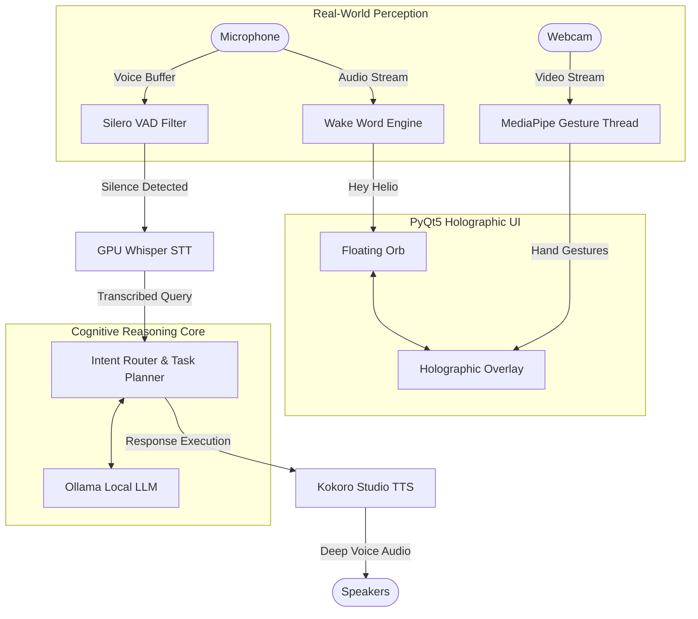

<div align="center">
  <br>
  <h1>🌌 HELIO</h1>
  <h3>The Next Evolution of Desktop Intelligence</h3>
  <p><strong>100% Offline • Zero-Latency Multimodal AI • Holographic Gesture Interface</strong></p>
  
  [](https://www.python.org/downloads/)
  [](https://riverbankcomputing.com/software/pyqt/)
  [](#)
  [](#)

  <br>
  <i>Any sufficiently advanced technology is indistinguishable from magic. Welcome to the future.</i>
  <br><br>
  <b>Designed and Built by <a href="https://github.com/DeepanBiswas07">Deepan</a></b>
  <br><br>
</div>

---

## 🚀 Why Helio?

Most AI assistants are just text boxes wrapped around a cloud API. **Helio is different.** 

Helio transforms your Windows desktop into a futuristic, interactive command center. It lives natively on your screen as a **transparent, physics-driven holographic orb**. You don't type to Helio—you **speak** to it, and you **gesture** to it. 

By combining GPU-accelerated speech recognition, real-time hand tracking, and local Ollama-powered cognitive reasoning, Helio achieves what was previously only seen in science fiction: a truly intelligent, zero-latency assistant that understands the world *around* your computer, all while keeping 100% of your data private and offline.

---

## 🔥 Masterpiece Features

<table>
<tr>
<td width="50%">
<h3>🔮 Holographic PyQt5 Interface</h3>
Helio ditches the traditional window frame. It manifests as a breathtaking, floating transparent orb that reacts to your mouse with physics-driven scaling. When summoned, it expands into a full-screen, immersive <b>Holographic Space Portal</b> that overlays your desktop with dynamic data planets and widgets.
</td>
<td width="50%">
<h3>🖐️ Real-Time Gesture Control</h3>
Why touch your mouse? Powered by a highly optimized background <b>MediaPipe</b> thread, Helio watches your webcam. Raise both hands to physically "pull open" the portal. Swipe left to navigate planets. Form a fist to dismiss windows. It is the ultimate hands-free interface.
</td>
</tr>
<tr>
<td width="50%">
<h3>🎙️ Zero-Latency Multimodal Voice</h3>
Say <i>"Hey Helio"</i> from across the room. An advanced <b>openwakeword</b> engine with 8.0x digital gain wakes the system instantly. A dynamic <b>Silero VAD</b> automatically detects when you finish speaking, feeding your voice directly into GPU-accelerated <b>Distil-Whisper</b> for instantaneous transcription.
</td>
<td width="50%">
<h3>🧠 Sovereign Cognitive Agent</h3>
Helio doesn't just chat. It acts. Backed by local <b>Ollama</b> models, Helio's routing engine can search your local file system, extract knowledge from your personal documents, automate Windows system controls, and answer questions using zero-API web scraping.
</td>
</tr>
</table>

---

## 📐 The Architecture of Intelligence

Helio is a marvel of multi-threaded asynchronous engineering. It seamlessly balances real-time perception layers (Computer Vision & Audio Processing) with heavy generative AI workloads without ever dropping a frame in the UI.



---

## ⚡ Unleashing the Tools

Helio is deeply integrated into your local machine. Its cognitive routing engine dynamically selects from a massive arsenal of autonomous tools based on your requests:

* **📁 File Intelligence:** Scans your hard drive, reads documents, and extracts insights.
* **🧠 Semantic Memory:** Indexes documents into local vector knowledge bases and remembers your personal preferences.
* **🖥️ OS Control:** Locates apps via the Windows Registry, locks your PC, adjusts volume, and captures screenshots.
* **🌐 Web Perception:** Scrapes live search results (Google, DuckDuckGo) without requiring any cloud API keys.

---

## 🛠️ Get Started (100% Offline)

Helio requires **no cloud subscriptions** and **no API keys**. 

### 1. Build the Engine
```powershell
# Create & activate the virtual environment
python -m venv .venv
.venv\Scripts\Activate.ps1

# Install the perception and AI frameworks
pip install -r requirements.txt
```

### 2. Ignite the Cognitive Core
Ensure [Ollama](https://ollama.com/) is running locally on port `11434`.
```powershell
# Pull the standard offline model
ollama pull llama3:8b

# (Optional) For massive GPU setups, pull the heavy coders
ollama pull qwen3-coder-next:cloud
```

### 3. Environment Setup
Copy the template configuration file:
```powershell
cp .env.example .env
```
Inside `.env`, customize your `OLLAMA_URL` and model roles.

---

## 🏃 Boot Sequence

Launch the holographic orb directly from the root workspace:
```powershell
.venv\Scripts\python ui/app.py
```

* **Calibrate Gestures:** Run the standalone visualizer to see the raw MediaPipe mesh overlay and gesture confidence scores in real-time:
  ```powershell
  .venv\Scripts\python gesture/main.py
  ```

---

## 🔧 Elite Troubleshooting

#### 1. "My Camera LED isn't turning on!"
Helio uses an **Advanced Camera Auto-Router**. If you have virtual cameras (like OBS) installed, Helio intelligently bypasses them to bind to your physical webcam (Index 1). If your camera is locked by Discord or Zoom, Helio enters a high-speed retry loop and will seize the camera the millisecond you close the conflicting app.

#### 2. "The app crashes silently on startup!"
PyQt5 and GPU-accelerated STT (Whisper) have brutally complex DLL load orders. Always launch the app via `ui/app.py`. Helio uses a custom bootloader to inject the required CUDA libraries *before* the UI engine initializes.

#### 3. "Helio can't hear my wake word from across the room."
Helio applies a dynamic `8.0x` digital audio gain boost specifically for the Wake Word listener. If it still fails, ensure your default Windows microphone is set correctly, or check the startup terminal logs to see which microphone hardware index Helio automatically seized.

---
<div align="center">
  
  <br>
  <b>Engineered for the future. Built by <a href="https://github.com/DeepanBiswas07">Deepan</a>.</b><br>
  <i>Welcome to Helio.</i>
</div>
