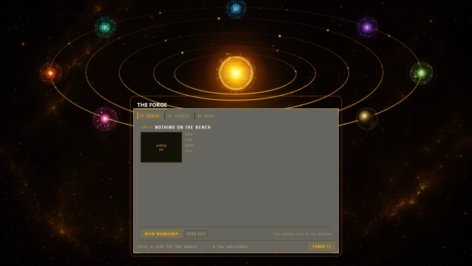
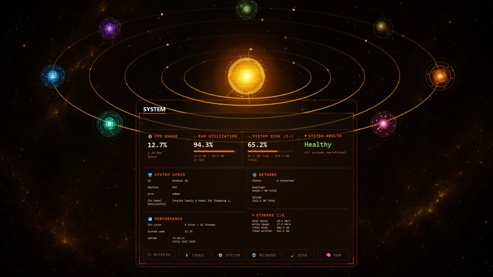
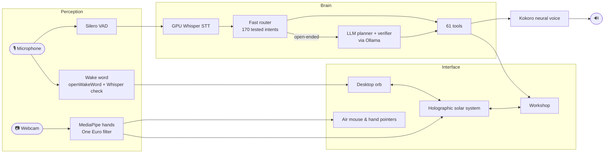

<div align="center">

<h1>🌌 HELIO</h1>

<h3>A holographic AI assistant that lives on your desktop.<br>Talk to it. Wave at it. Watch it build.</h3>

[](https://www.python.org/downloads/)
[](https://riverbankcomputing.com/software/pyqt/)
[](#-get-started)
[](https://ollama.com/)
[](LICENSE.md)

<br>


<br>

**Voice, hand gestures and an autonomous agent — in one holographic interface.**<br>
Say *"Hey Helio"*, and a floating orb opens into a living solar system of planets, each one a tool.<br>
Ask it to build a website and you watch the code being written, live, beside the finished page.

</div>

---

## ✨ Highlights

<table>
<tr>
<td width="50%" valign="top">

### 🪐 A solar system, not a window
Helio floats on your desktop as a glowing orb. Summon it and it unfolds into a full-screen **holographic solar system** — a burning sun, orbit rings, and eight planets that open into live panels: **Chat, Memory, Files, System, Schedule, Setup** and the **Forge**.

</td>
<td width="50%" valign="top">

### ⚒️ The Forge builds while you watch
*"Build me a website for my bakery."* Code streams into one panel while the page renders in the other. Multi-file projects, real photos fetched for the page, charts, documents and scripts — then *"make the buttons bigger"* and it revises in place.

</td>
</tr>
<tr>
<td width="50%" valign="top">

### 🎙️ Voice that keeps up with you
**"Hey Helio"** on its own, or **"Hey Helio, open Chrome"** in one breath — both work. GPU Whisper transcribes a command in about **0.4 s**, and a natural neural voice answers back.

</td>
<td width="50%" valign="top">

### 🖐️ Hands as the controller
Hand tracking through your webcam: a peace sign opens a command window, an open palm expands, a fist collapses, a swipe turns the carousel. **Clap** and your hand becomes a holographic **air mouse** — and in the workshop, **both hands** pick things up at once.

</td>
</tr>
</table>

---

## ⚒️ The Forge & the Workshop



<sub>Recorded live: *"build me a website for Nova, a smart home app…"* — Helio writes a multi-file project, streaming the source on the left while the page takes shape on the right. Sped up while it writes.</sub>

The Forge is where Helio makes things, and the **Workshop** is its full-screen bench:

- **Websites & apps** — single page or multi-file projects (HTML, CSS, JS), styled with verified CDN libraries; a dead stylesheet or script is caught and repaired before you ever see the page.
- **Real pictures** — ask for photos and Helio searches for fitting ones itself, filters out watermarked stock, and embeds them.
- **Charts, documents and code** — generated, saved and put on the bench.
- **Revise by talking** — *"use the picture on screen in the last website you made"*, *"make the hero not overlap the about section"*.
- **A bench you can grab** — every result is a slab: drag it, resize it, open it in your browser, scrap what you don't want.
- **Edit your own files** — point it at an existing project and it edits with a backup and a diff.

---

## 🖥️ Planets that are real tools



| Planet | What it does |
|---|---|
| 💬 **Chat** | Talk or type; conversations are remembered and searchable |
| 🧠 **Memory** | Facts you tell it, routines it notices, and what it has learned — all editable |
| 📁 **Files** | Find any file by description; study documents and ask questions about them |
| 🔥 **System** | Live CPU, RAM, disk, network and process monitoring |
| 🗓️ **Schedule** | Events, reminders and timers that it announces ahead of time |
| 🧩 **Setup** | Teach it a multi-step routine once, then run it by name |
| ⚒️ **Forge** | Build, watch, open — the gateway to the Workshop |

---

## 🧠 An agent that acts

Helio isn't a chatbot bolted onto a UI. Every request goes through a two-stage brain:

1. **A deterministic fast router** handles common intents instantly — no model call, sub-millisecond, covered by **170 routing tests**.
2. **An LLM planner** takes over for anything open-ended: it plans steps, calls tools, checks its own results with a verification pass, and asks before anything risky — scrapping builds, editing your files, launching apps or wiping its memory of you.

It has **61 tools** at hand:

| Area | Tools |
|---|---|
| **Build** | websites, apps, charts, documents, code, revise, edit existing files, scrap, open |
| **Workshop & UI** | open the workshop, put things on it, read what's on it, open any planet |
| **Web** | search, read pages, image search, YouTube |
| **Files & knowledge** | search the disk, read PDFs, study documents, answer questions from them |
| **Memory** | remember and forget facts, recall conversations, save and run workflows, learn patterns |
| **Schedule** | events, reminders, timers |
| **System** | launch apps, system info, date & time, **describe what's on your screen** |

---

## 🎛️ Under the hood

Built to feel instant on a laptop (tested on an RTX 3050 with 4 GB):

- **Two-path wake word** — an openWakeWord model for "Hey Helio", plus a Whisper check on the start of each sentence, so a command said in the same breath is caught *and kept*.
- **Nothing drops audio** — the sound callback only queues; wake word, voice activity and gain run on their own worker, so a busy UI can't eat your words.
- **Smart microphone pick** — every mic is listened to at startup; virtual devices rank last, and a muted or dead mic is reported plainly instead of failing silently.
- **Jitter-free hands** — One Euro filtering on hand landmarks, timestamped at capture, with coalesced frame delivery so the hologram never stutters when the UI is busy.
- **Cached holographic rendering** — orbit rings, planets, stars and panels are drawn from pixel-aligned caches, which took the solar system from **22 to 37 fps**, and the workshop from **17 to 60**.
- **Prompt caching** — prompts are built with stable prefixes so cloud models reuse their context.



<details>
<summary><b>Tech stack</b></summary>

| Layer | Technology |
|---|---|
| Interface | PyQt5 · QGraphicsView · QtWebEngine |
| Speech to text | faster-whisper (Distil-Whisper medium.en) on CUDA |
| Wake word & VAD | openWakeWord (custom "Hey Helio" model) · Silero VAD |
| Voice | Kokoro TTS |
| Vision | MediaPipe Hands · OpenCV |
| Reasoning | Ollama (cloud or local models) · deterministic intent router |
| Knowledge | sentence-transformers retrieval · local memory store |
| Web | DuckDuckGo search · lxml page reading |

</details>

---

## 🚀 Get started

**You'll need:** Windows 10 or 11 · Python 3.9+ · [Ollama](https://ollama.com/) · a microphone · a webcam for gestures · an NVIDIA GPU is strongly recommended.

### 1. Install

```powershell
git clone https://github.com/DeepanBiswas07/Helio.git
cd Helio
python -m venv .venv
.venv\Scripts\Activate.ps1

# On an NVIDIA GPU, install the CUDA build of PyTorch first (much faster voice):
pip install torch==2.8.0+cu128 torchvision==0.23.0+cu128 torchaudio==2.8.0+cu128 --index-url https://download.pytorch.org/whl/cu128

pip install -r requirements.txt
```

### 2. Connect a model

Helio talks to its language model through Ollama — a cloud model for the best results, or a local one.

```powershell
ollama pull gpt-oss:120b-cloud   # the default: fast and capable (needs an Ollama account)
ollama pull llama3:8b            # local fallback
```

### 3. Configure

```powershell
copy .env.example .env
```

### 4. Launch

```powershell
.venv\Scripts\python ui/app.py
```

The orb appears on your desktop. Say **"Hey Helio"**, or click the orb.

---

## 🗣️ Things to try

| Say | What happens |
|---|---|
| *"Hey Helio, build me a website for a coffee shop"* | The Workshop opens and the site is written live |
| *"Make the buttons bigger"* | Revises the last build in place |
| *"Find me a photo of the Kolkata skyline"* | Searches, downloads and puts it on the bench |
| *"Open the system planet"* | The carousel swings round and opens the panel |
| *"What's on my screen?"* | Describes the current screen |
| *"Remind me to call Ankit at 5:30"* | Sets a reminder and announces it on time |
| *"What have you learned about me?"* | Shows the routines and preferences it has picked up |

**Gestures:** ✌️ peace sign → then 🖐️ palm to expand, ✊ fist to collapse, swipe to turn planets · 👏 clap to toggle the air mouse · 🤏 pinch to click, hold to drag.

---

## ⚙️ Configuration

All settings live in `.env` (see [`.env.example`](.env.example)).

| Variable | Purpose |
|---|---|
| `FAST_MODEL` / `HEAVY_MODEL` | Ollama models for routing and for heavier work |
| `LOCAL_MODEL` | Fallback model when the cloud is unreachable |
| `VISION_MODEL` | Model used for "what's on my screen?" |
| `HELIO_MIC` | Force a microphone by name or index |
| `HELIO_WAKE_WHISPER` | `0` turns off the one-breath wake check |
| `HELIO_STT_MODEL` | Swap the speech-to-text model |

> **Privacy:** wake word, speech recognition, voice, hand tracking and memory all run on your machine. Requests go to the Ollama model you configure — local or cloud — and "what's on my screen?" sends a screenshot to your vision model.

---

## 🔧 Troubleshooting

<details>
<summary><b>Helio can't hear me</b></summary>

At startup Helio listens to every microphone for half a second and uses the best one that actually carries sound. The log lists each as `live` or `silent`. If it prints **`[MIC] … is sending pure silence`**, something below Helio is muting the mic: check the keyboard's mic-mute key, audio apps such as Nahimic, and *Settings › System › Sound › Input › Test your microphone*. Plug in a headset and Helio switches to it. To force a device, set `HELIO_MIC` in `.env`.
</details>

<details>
<summary><b>The camera light doesn't come on</b></summary>

Helio skips virtual cameras (such as OBS) and binds to your physical webcam. If another app holds the camera, Helio keeps retrying and takes it the moment it is free.
</details>

<details>
<summary><b>The app closes on startup</b></summary>

Always launch through `ui/app.py`: it loads the CUDA libraries for speech recognition before the interface starts, which avoids DLL conflicts on Windows.
</details>

<details>
<summary><b>Gestures feel off</b></summary>

Run the standalone visualiser to see the tracked hands and gesture state live:

```powershell
.venv\Scripts\python gesture/main.py
```
</details>

---

## 🗂️ Project map

```
Helio/
├── ui/
│   ├── app.py            ← start here
│   ├── orb/              desktop orb, solar system, planets, panels, workshop
│   ├── voice/            wake word, microphone pick, recording, speech-to-text, voice
│   └── services/         reminders, schedule, background learning
├── src/
│   ├── agent.py          request handling, planning and verification
│   ├── routing/          fast intent router and LLM planner
│   ├── tools/            the 61 tools (forge, web, files, memory, system…)
│   └── memory/           facts, observations, schedule, retrieval
├── gesture/              hand tracking, gestures, air mouse
├── evals/                routing test suite  (python evals/run.py)
└── models/               "Hey Helio" wake word model, voice
```

---

## 📜 License

Helio is released under the [PolyForm Noncommercial License 1.0.0](LICENSE.md) — free to use, study and modify for personal and non-commercial purposes. Commercial use requires a separate license: [get in touch](https://github.com/DeepanBiswas07).

<div align="center">
<br>

**Designed and built by [Deepan Biswas](https://github.com/DeepanBiswas07)**

<sub>If Helio made you smile, a ⭐ goes a long way.</sub>

</div>
